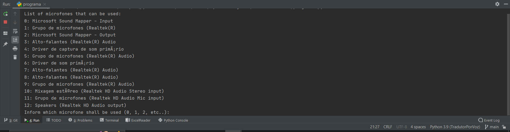

# Tradutor com Reconhecimento de Voz

O presente projeto visa criar um simples tradutor com reconhecimento de
voz utilizando a biblioteca SpeechRecognition e a biblioteca googletrans,
que por sua vez utiliza uma API do Google Translate.

O projeto é bem simples com intuito puramente didático.

Ao executar o programa.py, será impressa uma lista de ferramentas de áudio, 
onde pode-se escolher o microfone a ser utilizado:

  

Após isto, deve-se informar as linguagens de origem do áudio e para qual
linguagem se deseja a tradução. Por exemplo, para traduzir de português
('pt') para inglês ('en'):

  

Após isto o programa irá informar que está pronto para escutar sua voz
ao imprimir o texto "Next line". É necessário fazer uma pausa de mais 
ou menos 3 segundos para o programa entender que a frase acabou.

Após escutar, o programa imprime o texto
traduzido em forma de legenda na tela. Esta legenda sobrepõe todas as
outras janelas e não é clicável:
 

  
  
  
  
  

Com isto, é possível ir traduzindo sua fala enquanto navega por outros
programas e a legenda sempre estará visível.

Contudo, deve-se evitar frases muito longas uma vez que atualmente as 
legendas estão limitadas a 4 linhas para evitar bugs.

------------------------------
Contato:
-
[LinkedIn](https://www.linkedin.com/in/rodolpho-kades/)

[GitHub](https://github.com/rodskades)

<rodolpho_kades@hotmail.com>
